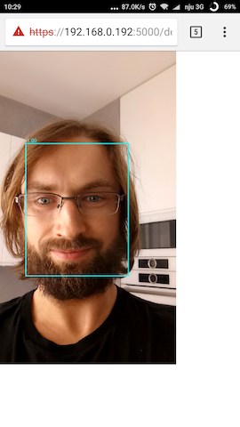

Face Recognition and Detection using Tensorflow Real-Time
=================================================================

The idea is to build application for a face detection (and in next step
recognition - see [TODOs](#TODOs)) using Tensorflow and notebook camera.

## Project assumptions
 - Tensorflow 1.7 and python 3
 - **Everything should be dockerized and easy to reproduce!**

## How to run it?

### Building docker

Type this in the root project's directory in order to:

### Build docker img
```bash
cd docker
make && cd ..
```

### Run project

```bash
docker run --rm -it -p 5000:5000 -v /$(pwd):/workspace btwardow/tf-face-recognition:dev
```

Then got to [http://localhost:5000/detect](http://localhost:5000/detect) or type
it in your browser to get face detection (without recognition for now).


## Face detection


## Face recognition

TODO

## Why making web application for this?

_Everything should be dockerized and easy to reproduce_. This makes things
interesting even for a toy project from the computer vision area. Why?

 - building model/playing around in Jupyter/Python - that's easy...  inference
 - on data grabbed from the host box camera inside docker - that's tricky!

Why is hard to grab data from camera device from docker? You can read
[here](https://apple.stackexchange.com/questions/265281/using-webcam-connected-to-macbook-inside-a-docker-container).
The main reason - docker is not build for such things, so it's not making life
easier for here.  Of course few possibilities are mentioned, like streaming from
the host MBP using `ffmpeg` or preparing custom Virtualbox
`boot2docker.iso` image and making the MBP [webcam pass
through](https://www.virtualbox.org/manual/ch09.html#webcam-passthrough). But
all of them dosn't sound right. All requires additiona effort of installing sth
from `brew` or Virualbox configuration (assuming you have docker installed on
your OSX).

The good side of having this as a webapp is fact that **you can try it out on your mobile phone!**
What is very convenient for testing and demos.



## TODOs
<a name="TODOs"></a>
 - [x] face detection with a pre-trained MTCNN network
 - [ ] training face recognition classifier (use pre-trained embedding + classifier) based on provided examples
 -
 - [ ] check if detection can be done faster, if so re-implement it (optimize MTCNN for inference?)
 - [ ] face recognition from web
 - [ ] try out port it to Trensorflow.js

