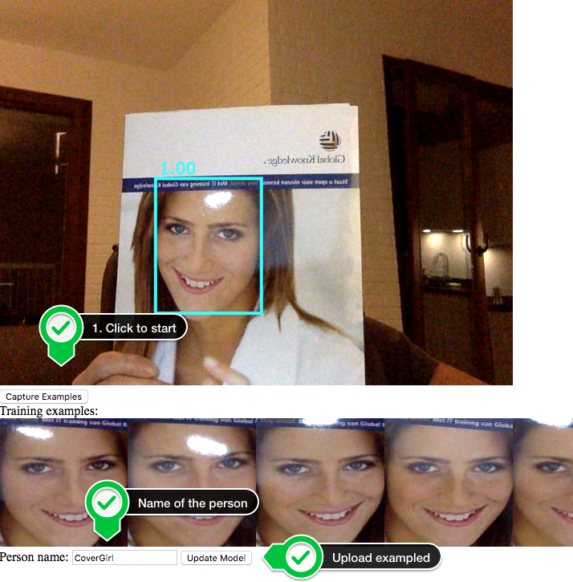
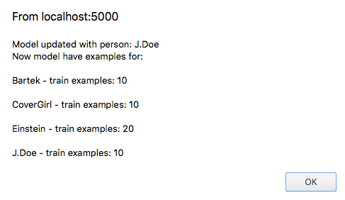
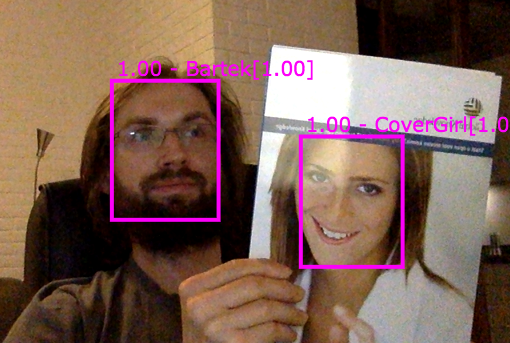

Real-Time Face Recognition and Detection using Tensorflow
=================================================================

The idea is to build application for a real-time face detection and
recognition using Tensorflow and a notebook's webcam. The model for
face prediction should be easy to update online to add new targets.

## Project assumptions
 - Tensorflow 1.7 and python 3
 - **Everything should be dockerized and easy to reproduce!**

## How to run it?

### Run it right away from the pre-build image

Just type:

```bash
docker run -it --rm -p 5000:5000 btwardow/tf-face-recognition:1.0.0
```

Then got to [https://localhost:5000/](https://localhost:5000/) or type
it in your browser to get face detection (without recognition for now).

_Note: HTTPS is required from many modern browsers to transfer video outside the localhost,
without making any unsafe settings to your browser._


### Building docker

Type this in the root project's directory in order to:

#### Create docker image

Use main target from Makefile of main directory:

```bash
make
```

#### Run project

```bash
docker run --rm -it -p 5000:5000 -v /$(pwd):/workspace btwardow/tf-face-recognition:dev
```

This volume mapping is very convenient for the development and testing purposes.

To use GPU power - there is dedicated [Dockerfile.gpu](./docker/Dockerfile.gpu).


## Why making a web application for this?

_Everything should be dockerized and easy to reproduce_. This makes things
interesting even for a toy project from the computer vision area. Why?

 - building model/playing around in Jupyter/Python - that's easy...  inference
 - on data grabbed from the host box camera inside docker - that's tricky!

Why is hard to grab data from camera device from docker? You can read
[here](https://apple.stackexchange.com/questions/265281/using-webcam-connected-to-macbook-inside-a-docker-container).
The main reason - docker is not build for such things, so it's not making life
easier for here.  Of course few possibilities are mentioned, like streaming from
the host MBP using `ffmpeg` or preparing custom Virtualbox
`boot2docker.iso` image and making the MBP [webcam pass
through](https://www.virtualbox.org/manual/ch09.html#webcam-passthrough). But
all of them dosn't sound right. All requires additiona effort of installing sth
from `brew` or Virualbox configuration (assuming you have docker installed on
your OSX).

The good side of having this as a webapp is fact that **you can try it out on your mobile phone!**
What is very convenient for testing and demos.


## Face detection

Face detection is done to find faces from the video and mark it boundaries. These are
areas that can be future use for the face recognition task. To detect faces the
pre-trained MTCNN network is being used.


## Face recognition

The face detection is using embedding from the VGGFace2 network + KNN model implemented in Tensorflow.

In order to get your face recognized first a few examples have to be provided to our algorithm (now - at least 10).

When you see the application working and correctly detecting faces just click the _**Capture Examples**_ button.

**While capturing examples for the face detection there have to be single face in video!**



After 10 examples are collected, we can type the name of the person and upload them to server.

As a result we see the current status of classification examples:





And from now on, the new person is recognized. For this example it's _CoverGirl_.

### One more example


### Running Jupyter Notebook and reproducing analysis

If you are interested about the classification, please check out this [notebook](./notebooks/experiments_with_classification.ipynb) which will explain in details how it works (e.g. threshold for the recognition).

You can run jupyter notebook from the docker, just type:

```bash
docker run --rm -it -p 8888:8888 btwardow/tf-face-recognition:1.0.0 /run_jupyter.sh --allow-root
```


## TODOs
<a name="TODOs"></a>
 - [x] face detection with a pre-trained MTCNN network
 - [x] training face recognition classifier (use pre-trained embedding + classifier) based on provided examples
 - [x] model updates directly from the browser
 - [ ] save & clear classification model from the browser
 - [ ] check if detection can be done faster, if so re-implement it (optimize MTCNN for inference?)
 - [ ] try out port it to Trensorflow.js


## Thanks

Many thanks to creators of `facenet` project, which provides pre trained models. Great job!
